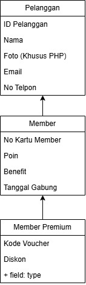

# TP2DPBO2526C2

# Janji: 
Saya Nabil Azka Saputra dengan NIM 2507096 mengerjakan Tugas Praktikum 2 pada Mata Kuliah Desain dan Pemrograman Berorientasi Objek untuk keberkahan-Nya maka saya tidak melakukan kecurangan seperti yang telah dispesifikasikan. Aamiin

### Diagram:
 

Member mewarisi atribut dan method dari Pelanggan, sedangkan MemberPremium mewarisi atribut dan method dari Member sekaligus mewarisi fitur dari Pelanggan.

### Atribut dan Methods:
### A. Class `Pelanggan`

Class `Pelanggan` merupakan parent class atau class paling atas. Class ini merepresentasikan pelanggan biasa/non-member.

**Atribut:**

| Atribut | Tipe | Keterangan |
|---|---|---|
| `id_pelanggan` | `int` | ID unik pelanggan |
| `nama` | `str` | Nama pelanggan |
| `email` | `str` | Email pelanggan |
| `no_telepon` | `str` | Nomor telepon pelanggan |

**Methods:**

| Method | Keterangan |
|---|---|
| `get_id()` | Mengambil ID pelanggan |
| `get_nama()` | Mengambil nama pelanggan |
| `get_email()` | Mengambil email pelanggan |
| `get_no_telepon()` | Mengambil nomor telepon |
| `set_nama(nama)` | Mengubah nama pelanggan |
| `set_email(email)` | Mengubah email pelanggan |
| `set_no_telepon(no_telepon)` | Mengubah nomor telepon |
| `get_tipe()` | Mengembalikan tipe `"Non-Member"` |
| `to_row()` | Mengubah data object menjadi satu baris tabel |

### B. Class `Member`

Class `Member` merupakan turunan dari `Pelanggan`. Member memiliki seluruh atribut pelanggan ditambah atribut khusus keanggotaan.

**Atribut tambahan:**

| Atribut | Tipe | Keterangan |
|---|---|---|
| `no_kartu_member` | `str` | Nomor kartu member |
| `poin` | `int` | Poin reward member |
| `tanggal_gabung` | `str` | Tanggal bergabung sebagai member |
| `benefit` | `str` | Benefit yang diperoleh member |

**Methods tambahan/override:**

| Method | Keterangan |
|---|---|
| `get_no_kartu_member()` | Mengambil nomor kartu member |
| `get_poin()` | Mengambil jumlah poin |
| `get_tanggal_gabung()` | Mengambil tanggal bergabung |
| `get_benefit()` | Mengambil benefit |
| `set_poin(poin)` | Mengubah jumlah poin |
| `set_tanggal_gabung(tanggal_gabung)` | Mengubah tanggal bergabung |
| `set_benefit(benefit)` | Mengubah benefit |
| `tambah_poin(jumlah)` | Menambahkan poin reward |
| `get_tipe()` | Override dari parent dan mengembalikan `"Member"` |
| `to_row()` | Override untuk menampilkan atribut khusus Member |

### C. Class `MemberPremium`

Class `MemberPremium` merupakan turunan dari `Member`, sehingga mewarisi atribut dan method dari `Member` dan `Pelanggan`.

**Atribut tambahan:**

| Atribut | Tipe | Keterangan |
|---|---|---|
| `kode_voucher` | `str` | Kode voucher member premium |
| `diskon` | `float` | Besaran diskon |
| `free_upgrade_seat` | `bool` | Status fasilitas free upgrade seat |

**Methods tambahan/override:**

| Method | Keterangan |
|---|---|
| `get_kode_voucher()` | Mengambil kode voucher |
| `get_diskon()` | Mengambil nilai diskon |
| `get_free_upgrade_seat()` | Mengambil status free upgrade seat |
| `set_kode_voucher(kode_voucher)` | Mengubah kode voucher |
| `set_diskon(diskon)` | Mengubah nilai diskon |
| `set_free_upgrade_seat(free_upgrade_seat)` | Mengubah status free upgrade seat |
| `gunakan_voucher()` | Menampilkan pesan bahwa voucher berhasil digunakan |
| `get_tipe()` | Override dan mengembalikan `"Member Premium"` |
| `to_row()` | Override untuk menampilkan atribut khusus MemberPremium |
